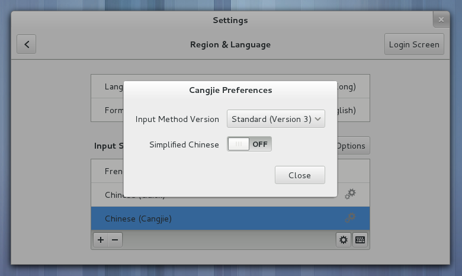
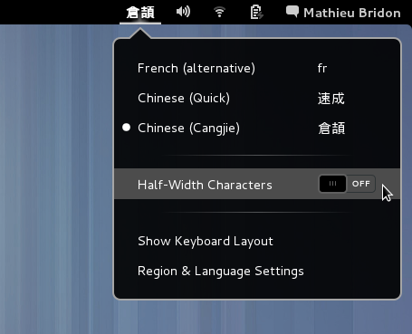

Features
========

IBus Cangjie implements the Cangjie and Quick input methods.

.. note:: The following screen captures have been taken on GNOME 3.8, but it
          should work in any environment where IBus itself runs.

You can launch the preferences application from the *GNOME Settings*, or from
the *application menus* in your operating system of choice.

It looks like this:

As you can see above, it allows you to choose between Cangjie (or Quick)
*version 3 or 5*, depending on the one you prefer using. The default is
version 3.

.. note:: Hint: If you don't know which version to use, try version 3. Most
          people use this version, as it is the one implemented in Microsoft
          Windows.

It also allows you to enable *Simplified Chinese* input. By default, IBus
Cangjie will only let you input *Traditional Chinese*. This option simply
**adds** Simplified Chinese characters, so once enabled you will get
suggestions in **both** Simplified and Traditional Chinese.

Some users prefer their non-Chinese characters (numbers, punctuation,...) to
be *half-width*, others prefer *full-width*, and the rest will want to change
frequently, depending on the text they are typing.

IBus Cangjie covers all these use cases with a property which can be changed
quickly, without having to go back to the preferences application:

Finally, IBus Cangjie is **fully localized** into Chinese. (a Chinese version
of this website will come soon)
